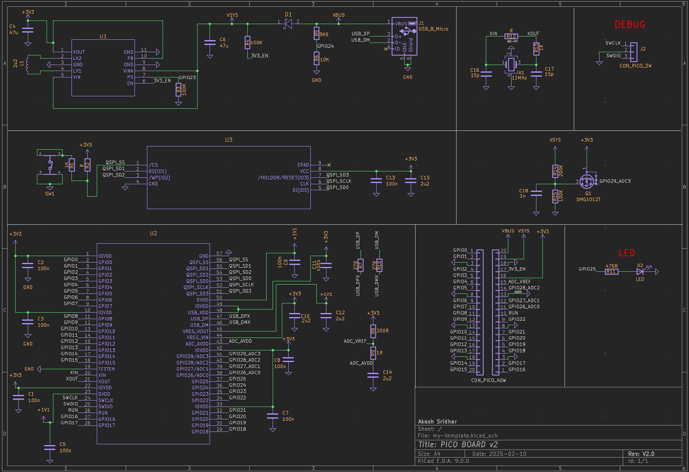
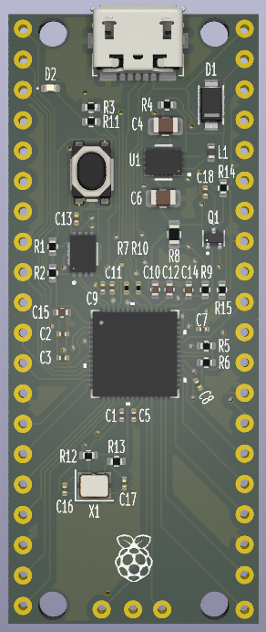

# Pico-Board-V2
PICO Board v1 : [Github Link](http://github.com/newasr/Pico-board)

Changes:
- Resolved DRC and ERC which were there in v1.
- Added the Raspberry Pi logo for a more authentic look.
- Standardized component names to be horizontally aligned for a cleaner and more readable design.

# Schematic

# 3D View

